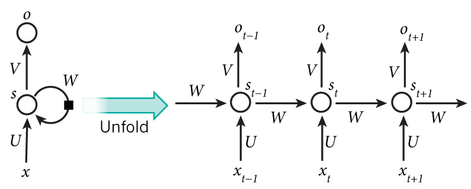

### Convolutional Neural Network

{: .boxit}
Convolution is a mathematical term, here referring to an operation between two matrices. The convolutional layer has a fixed small matrix defined, also called kernel or filter. As the kernel is sliding, or convolving, across the matrix representation of the input image, it is computing the element-wise multiplication of the values in the kernel matrix and the original image values. [Specially designed kernels](https://setosa.io/ev/image-kernels/) can process images for common purposes like blurring, sharpening, edge detection and many others, fast and efficiently.

### Recurrent Neural Network

{: .boxit}
A sequence model is usually designed to transform an input sequence into an output sequence that lives in a different domain. Recurrent neural network, short for “RNN”, is suitable for this purpose and has shown tremendous improvement in problems like handwriting recognition, speech recognition, and machine translation

循环神经网络模型具有处理长时间序列数据和时间上具有上下文关系的任务的能力。该模型以一个时间步长处理序列中的一个元素。计算结束后，新更新的单元状态会传递到下一个时间步，以方便下一个元素的计算。e.g. 一个RNN模型逐字逐句地阅读了所有的维基百科文章，然后它可以在给定上下文的情况下预测之后的单词。

[_LeCun, Bengio, and Hinton, 2015; Fig. 5_](http://pages.cs.wisc.edu/~dyer/cs540/handouts/deep-learning-nature2015.pdf)[[ A recurrent neural network with one hidden unit (left) and its unrolling version in time (right). The unrolling version illustrates what happens in time: $$s_{t−1}$$, $$s_t$$, and $$s_{t+1}$$ are the same unit with different states at different time steps $$t−1$$, $$t$$, and $$t+1$$. ::rsn]]

#### LSTM
然而，简单感知神经元如果仅仅将当前输入元素和上一个单位状态线性结合，很容易失去长期依赖性。e.g. 我们以 "Alice is working at...... "作为开头，经过一段时间后，我们又以 "She"或 "He"作为下一句的开头, 我们无法知道模型忘记了人物的名字 "Alice"。为了解决这个问题，研究人员创造了一种特殊的神经元，其内部结构更加复杂，用于记忆长期上下文，被命名为 "Long-short Term Memory(LSTM)" 神经元。

LSTM足够聪明，它可以知道旧的信息应该记忆多久，什么时候忘记，什么时候利用新的数据，以及如何将旧的记忆和新的输入结合起来。

这里有一篇很好的[介绍](http://colah.github.io/posts/2015-08-Understanding-LSTMs/)。

### Reinforcement Learning

{: .boxit}
Reinforcement learning (“RL”) is one of the secrets behind its success. RL is a subfield of machine learning which allows machines and software agents to automatically determine the optimal behavior within a given context, with a goal to maximize the long-term performance measured by a given metric.

### Generative Adversarial Network

{: .boxit}
Generative adversarial network, short for “GAN”, is a type of deep generative models. GAN is able to create new examples after learning through the real data. It is consist of two models competing against each other in a zero-sum game framework. 

在[最初的GAN论文](https://arxiv.org/pdf/1406.2661.pdf)中，提出了从真实照片学习后生成有意义的图像。它包括两个独立的模型：生成器和判别器。生成器产生假图像，并将输出发送给判别器模型。鉴别器的工作原理就像一个法官，因为它是经过优化的，可以从假照片中识别出真照片。生成器模型在努力欺骗鉴别器，而法官则在努力不被欺骗。这两个模型之间的这种有趣的零和博弈，促使两者都发展自己设计的技能，改进自己的功能。最终，我们采取生成器模型来生产新的图像。