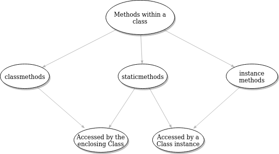

### @staticmethod in Python

- Python @staticmethod decorator is used to label a class method as a static method, which means that it can be called without >  instantiating the class first. It simply defines a normal function that is logically contained in the class for readability purposes. Here, we do not need to pass the class instance as the first argument via self, unlike other class functions.

    ```python
    class Student():
        def __init__(self, mark):
            self.mark = mark

        @staticmethod
        def find_min(mark):
            return min(mark, 100)

    print(Student.find_min(20))
    # output
    # 20
    ```

- Static methods can also be accessed via class instances or objects. For example :
    ```python
        class Bank():
            def __init__(self, balance):
                self.balance = balance
        
            @staticmethod
            def find_interest(loan_money, interest_rate):
                return loan_money * (1 + interest_rate)
        
        bank = Bank(1000)
        print(bank.find_interest(bank.balance, 0.3))
        ```

- Comparison between @staticmethod, @classmethod, instance method
  